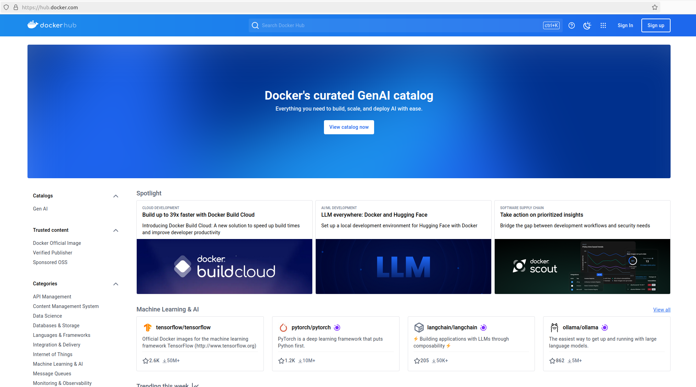
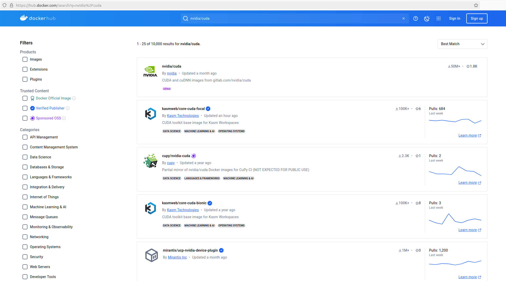
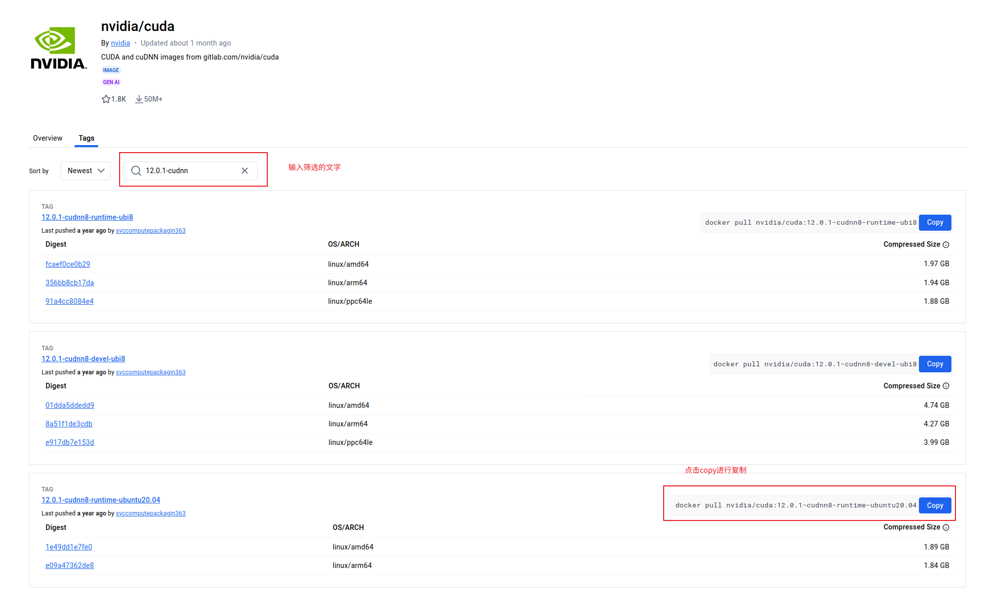
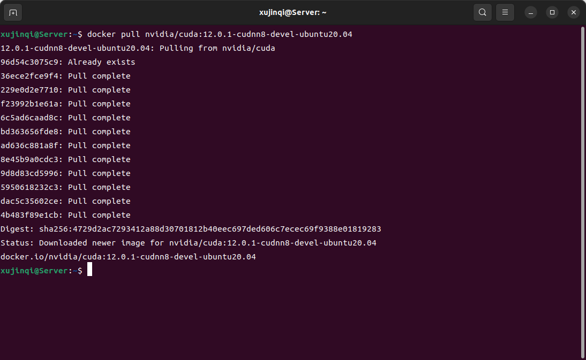

# 创建容器

## 拉取文件镜像

docker拉取镜像是从dockerhub上进行浏览然后进行拉取

dockerhub网址：https://hub.docker.com/



在这个网页可以搜索对应的镜像，以cuda、cudnn为例

1. 搜索nvidia/cuda
   

2. 进入nvidia/cuda，在tags页面搜索对应的镜像，以cuda12.01 cudnn8 ubuntu20.04为例
   在输入框输出12.0.1-cudnn8，然后点击对应镜像的copy就可以将bash命令复制到剪切板，在终端中粘贴运行就可以拉取该镜像
   
   注意：一般情况下我们下载devel版本，而不是下载runtime版本，因为devel版本有完整的资源，runtime版本后续还需要额外的配置才能使用cuda

3. 拉取镜像
   在终端中输入

   ```bash
   docker pull nvidia/cuda:12.0.1-cudnn8-devel-ubuntu20.04
   ```

   等待下载完成即可（由于延迟可能需要等待），出现如下界面则表示下载完成
    

## 创建容器

在终端输入命令

```bash
docker run -it --name test --gpus all -p 1234:22 nvidia/cuda:12.0.1-cudnn8-devel-ubuntu20.04
```

> -it 以交互模式运行，即进入容器内部
>
> --name test 将容器命名为test
>
> --gpus all 允许使用所有GPU，没有这个参数就不能使用gpu
>
> -p 1234:22 将宿主机的1234端口映射到容器的22端口，可以用于ssh连接
>
> nvidia/cuda:12.0.1-cudnn8-devel-ubuntu20.04 镜像名:版本号
>
> docker kill      杀掉容器
>
> docker start    开启容器
>
> docker exec    进入容器
>
> docker ps      显示运行中的容器

进入容器后可以使用`nvidia-smi`来查看是否可以调用gpu，`nvcc -V`来查看cuda版本


